## Nadzu-API

My Personal Backend API built with Rust.  
Highly focused on concurrency, performance, security, and future-proof design.

### Major Functions
- Multi-platform media downloading with yt-dlp.
- Anti-abuse measures: tiered rate limiting (enhanced for valid API key), CAPTCHA verification.
- IaC Terraform infrastructure using DigitalOcean provider.
- Published to Private GitHub Container Registry.

### Design and Architecture
- Clean layered architecture (controllers → services → models)
- Sharding: DashMap, memory lifecycle: weak references, Tokio semaphore for concurrency control.
- Makefile-first approach for task automation and consistency.

### File Structure
<details>
<summary>Directory Structure (overall)</summary>

```text
.
|-- Caddyfile
|-- Caddyfile.local
|-- Cargo.lock
|-- Cargo.toml
|-- Dockerfile
|-- Dockerfile.dev
|-- LICENSE
|-- Makefile
|-- README.md
|-- docker-compose.dev.yml
|-- docker-compose.yml
|-- docker-entrypoint.sh
|-- docs
|   `-- images
|       |-- Themed-Architecture-Diagram-code.md
|       `-- Themed-Architecture-Diagram.svg
|-- nadunssh
|-- postman
|   |-- collections
|   |   `-- Nadzu API
|   |       |-- Health.request.yaml
|   |       |-- Root.request.yaml
|   |       |-- Validate User.request.yaml
|   |       |-- YT-DLP Download File.request.yaml
|   |       |-- YT-DLP Enqueue.request.yaml
|   |       |-- YT-DLP Get Job By ID.request.yaml
|   |       |-- YT-DLP List Jobs.request.yaml
|   |       |-- YT-DLP Stream Job Progress.request.yaml
|   |       `-- supported sites.request.yaml
|   `-- environments
|       `-- Nadzu Local.yaml
|-- rustfmt.toml
|-- src
|   |-- app.rs
|   |-- config.rs
|   |-- controllers
|   |   |-- api
|   |   |   |-- mod.rs
|   |   |   `-- v1
|   |   |       |-- mod.rs
|   |   |       `-- ytdlp_controller.rs
|   |   |-- error_controller.rs
|   |   |-- health_controller.rs
|   |   |-- mod.rs
|   |   |-- root_controller.rs
|   |   `-- validation_controller.rs
|   |-- db
|   |   |-- mod.rs
|   |   |-- postgres.rs
|   |   `-- redis.rs
|   |-- error.rs
|   |-- extractors
|   |   |-- mod.rs
|   |   `-- validated_json.rs
|   |-- lib.rs
|   |-- main.rs
|   |-- middleware
|   |   |-- api_key.rs
|   |   |-- auth.rs
|   |   |-- captcha.rs
|   |   |-- cors.rs
|   |   |-- mod.rs
|   |   `-- rate_limit.rs
|   |-- models
|   |   |-- health_model.rs
|   |   |-- mod.rs
|   |   |-- validation_model.rs
|   |   `-- ytdlp_model.rs
|   |-- routes
|   |   |-- api
|   |   |   |-- mod.rs
|   |   |   `-- v1
|   |   |       |-- mod.rs
|   |   |       `-- ytdlp_routes.rs
|   |   |-- health_routes.rs
|   |   |-- mod.rs
|   |   `-- validation_routes.rs
|   |-- services
|   |   |-- mod.rs
|   |   `-- ytdlp
|   |       `-- mod.rs
|   `-- state.rs
|-- tests
|   |-- api
|   |   |-- auth_tests.rs
|   |   |-- captcha_tests.rs
|   |   |-- common.rs
|   |   |-- cors_tests.rs
|   |   |-- health_tests.rs
|   |   |-- rate_limit_tests.rs
|   |   |-- root_tests.rs
|   |   |-- routing_tests.rs
|   |   |-- validation_tests.rs
|   |   `-- ytdlp_tests.rs
|   |-- api_tests.rs
|   `-- layer_unit_tests.rs

```
</details>

### Infrastructure
- CloudFlare R2 Backend for Terraform Backend.
- DigitalOcean Terraform provider. with Droplets, Volumes.
- Cloud-init based provisioning for Droplets.
<details>
<summary>Infrastructure Diagram</summary>



</details>

<details>
<summary>Directory Structure (Terraform)</summary>

```text
infra/
├── common/
│   └── cloud-init.template                 # Bootstraps the VM (Docker, secrets, runs container)
└── digitalocean/
    ├── accounts/<account-name>/            # Root module per account/environment
    │   ├── backend.tf                      # Cloudflare R2 remote state setup
    │   ├── main.tf                         # Calls the components module
    │   ├── outputs.tf                      # Exposed outputs (Droplet IP, etc.)
    │   ├── terraform.tfvars                # Secret & environment bindings (gitignored)
    │   └── variables.tf                    # Root variable definitions
    └── components/                         # The reusable DigitalOcean module
        ├── locals.tf                       # Local variables; renders cloud-init
        ├── outputs.tf                      # Module outputs
        ├── provider.tf                     # DigitalOcean Terraform provider configuration
        ├── r-digitalocean_droplet.tf       # VM resource definitions
        ├── r-digitalocean_volume*.tf       # Block storage resource & attachment
        ├── variables.tf                    # Component variable definitions
        └── versions.tf                     # Terraform & provider dependencies
```
</details>

### Technical Details

- Download acceleration
  - `yt-dlp` external downloader integration with `aria2c`

- Dockerized
  - Dockerfile
    - 5 stage build.
    - Cargo-Chef.
    - tini.
  - Docker Compose for local development

- CI with GitHub Actions
  - Linting with `cargo clippy`
  - Testing with `cargo test`
  - Building with `cargo build`

- Full test coverage capable with `cargo test`
- Comprehensive Makefile.

### Infrastructure

[](https://www.digitalocean.com/?refcode=17bb57d3d632&utm_campaign=Referral_Invite&utm_medium=Referral_Program&utm_source=badge)


## Thanks to 🙌

### Third-Party Components

- yt-dlp [yt-dlp](https://github.com/yt-dlp/yt-dlp)