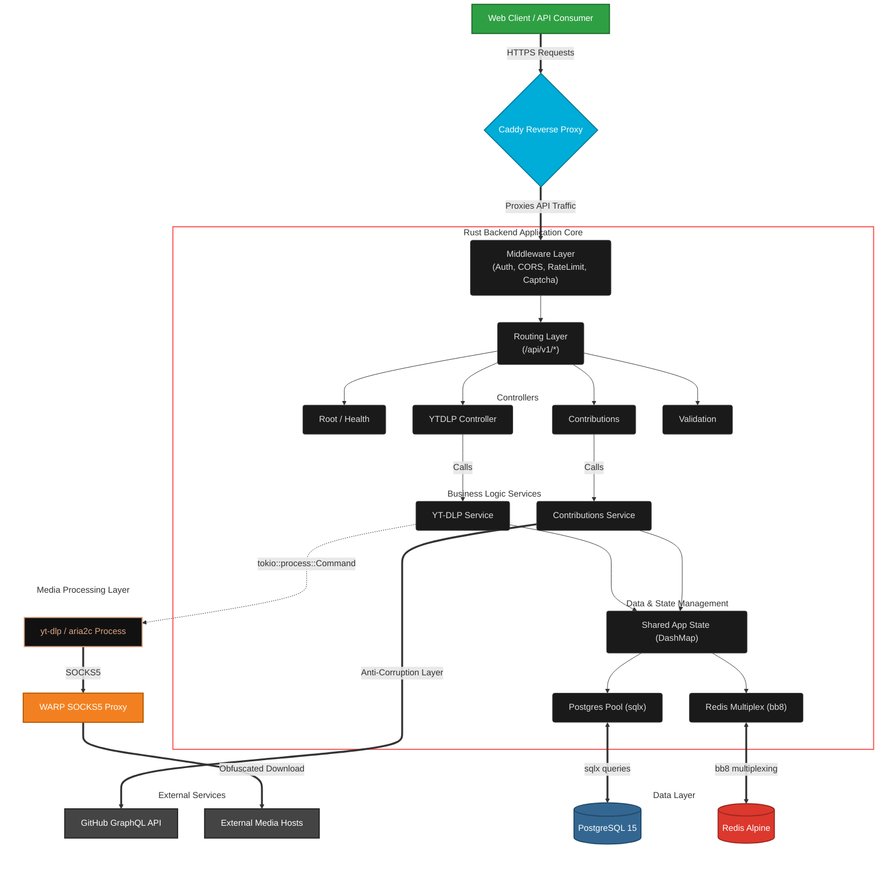
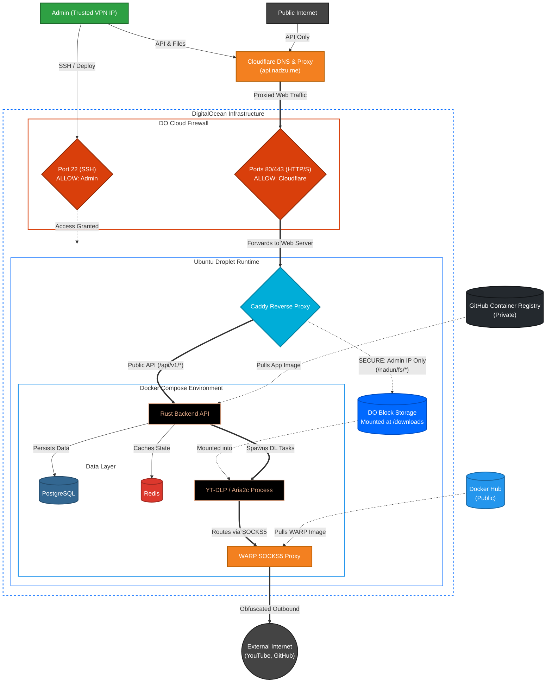

# Nadzu-API

Personal backend API built with Rust, focused on concurrency, performance, security, and long-term maintainability.

## Architecture at a Glance

<details>
<summary>Core system diagram</summary>



</details>

<details>
<summary>Infrastructure diagram</summary>



</details>

## Features

### Core API

* CORS handling.
* Rate limiting.
* API versioning (v1).
* Health and root endpoints.
* Structured logging.
* Postman v3 collection included.

### Media Downloading

* Multi-platform media downloading via yt-dlp.
* Download acceleration via aria2c integration.
* Job lifecycle management: enqueue, progress tracking, and result retrieval.
* Server-Sent Events (SSE) for real-time job progress updates.
* Endpoint for listing supported sites.

### Proxy Obfuscation

* Bypasses geo-restrictions and anti-bot measures.
* Dedicated container that uses the Cloudflare WARP client for outbound requests.
* Uses a custom [**Cloudflare WARP Proxy Docker Image**][docker-hub-image] (1.1k pulls), maintained in [**its dedicated repository**][warp-proxy-repo].

### Security and Anti-Abuse

* CAPTCHA verification middleware powered by reCAPTCHA.

### Operational

* CI pipelines for linting, testing, and building.
* CD pipeline for Docker image builds and publishing to GitHub Container Registry, including:
    * zstd compression
    * zstd builder
    * custom BuildKit caching for faster builds
    * multi-platform Docker image support

## Engineering Design

* Clean layered architecture (controllers -> services -> models).
* Memory management with DashMap sharding and weak references for lifecycle control.
* Concurrency control using Tokio semaphores.

## Development Workflow

* Iterative development flow designed for fast delivery.
* Makefile-first approach for task automation and consistency.
* CI pipeline using GitHub Actions for linting (`cargo clippy`), testing (`cargo test`), and building.
* Unit and integration test coverage.
* Production-like local development environment using Docker Compose and Caddy with self-signed TLS.
* Active [**Public Changelog**][changelog] including release notes.

## Packaging and Deployment

* Dockerized using multi-stage and multi-platform builds (5-stage build with tini).
* Optimized Rust builds using Cargo-Chef.
* Custom Docker builder implementing ZSTD compression.
* Pre-installed dependencies: yt-dlp Python packages, FFmpeg, and FFprobe for media validation.
* Published automatically to a private GitHub Container Registry.

## Infrastructure

[![DigitalOcean Referral Badge][do-referral-badge]][do-referral-link]

Provisioned with Terraform using Infrastructure as Code principles.

* **DigitalOcean Provider:** Droplet provisioning with cloud-init, block volume management, and firewall configuration.
* **Cloudflare Provider:** R2 bucket used for Terraform remote state and DNS record management for full HTTPS support.

## Project Structure

<details>
<summary>Application Directory Structure</summary>

```text
.
|-- Caddyfile
|-- Caddyfile.local
|-- Cargo.lock
|-- Cargo.toml
|-- Dockerfile
|-- Dockerfile.dev
|-- LICENSE
|-- Makefile
|-- README.md
|-- docker-compose.dev.yml
|-- docker-compose.yml
|-- docker-entrypoint.sh
|-- docs
|   `-- images
|       |-- Themed-Architecture-Diagram-code.md
|       `-- Themed-Architecture-Diagram.svg
|-- nadunssh
|-- postman
|   |-- collections
|   |   `-- Nadzu API
|   |       |-- Health.request.yaml
|   |       |-- Root.request.yaml
|   |       |-- Validate User.request.yaml
|   |       |-- YT-DLP Download File.request.yaml
|   |       |-- YT-DLP Enqueue.request.yaml
|   |       |-- YT-DLP Get Job By ID.request.yaml
|   |       |-- YT-DLP List Jobs.request.yaml
|   |       |-- YT-DLP Stream Job Progress.request.yaml
|   |       `-- supported sites.request.yaml
|   `-- environments
|       `-- Nadzu Local.yaml
|-- rustfmt.toml
|-- src
|   |-- app.rs
|   |-- config.rs
|   |-- controllers
|   |   |-- api
|   |   |   |-- mod.rs
|   |   |   `-- v1
|   |   |       |-- mod.rs
|   |   |       `-- ytdlp_controller.rs
|   |   |-- error_controller.rs
|   |   |-- health_controller.rs
|   |   |-- mod.rs
|   |   |-- root_controller.rs
|   |   `-- validation_controller.rs
|   |-- db
|   |   |-- mod.rs
|   |   |-- postgres.rs
|   |   `-- redis.rs
|   |-- error.rs
|   |-- extractors
|   |   |-- mod.rs
|   |   `-- validated_json.rs
|   |-- lib.rs
|   |-- main.rs
|   |-- middleware
|   |   |-- api_key.rs
|   |   |-- auth.rs
|   |   |-- captcha.rs
|   |   |-- cors.rs
|   |   |-- mod.rs
|   |   `-- rate_limit.rs
|   |-- models
|   |   |-- health_model.rs
|   |   |-- mod.rs
|   |   |-- validation_model.rs
|   |   `-- ytdlp_model.rs
|   |-- routes
|   |   |-- api
|   |   |   |-- mod.rs
|   |   |   `-- v1
|   |   |       |-- mod.rs
|   |   |       `-- ytdlp_routes.rs
|   |   |-- health_routes.rs
|   |   |-- mod.rs
|   |   `-- validation_routes.rs
|   |-- services
|   |   |-- mod.rs
|   |   `-- ytdlp
|   |       `-- mod.rs
|   `-- state.rs
|-- tests
|   |-- api
|   |   |-- auth_tests.rs
|   |   |-- captcha_tests.rs
|   |   |-- common.rs
|   |   |-- cors_tests.rs
|   |   |-- health_tests.rs
|   |   |-- rate_limit_tests.rs
|   |   |-- root_tests.rs
|   |   |-- routing_tests.rs
|   |   |-- validation_tests.rs
|   |   `-- ytdlp_tests.rs
|   |-- api_tests.rs
|   `-- layer_unit_tests.rs
```

</details>

<details>
<summary>Terraform Directory Structure</summary>

```text
infra/
├── common/
│   └── cloud-init.template                 # Bootstraps the VM (Docker, secrets, runs container)
└── digitalocean/
    ├── accounts/<account-name>/            # Root module per account/environment
    │   ├── backend.tf                      # Cloudflare R2 remote state setup
    │   ├── main.tf                         # Calls the components module
    │   ├── outputs.tf                      # Exposed outputs (Droplet IP, etc.)
    │   ├── terraform.tfvars                # Secret & environment bindings (gitignored)
    │   └── variables.tf                    # Root variable definitions
    └── components/                         # The reusable DigitalOcean module
        ├── locals.tf                       # Local variables; renders cloud-init
        ├── outputs.tf                      # Module outputs
        ├── provider.tf                     # DigitalOcean Terraform provider configuration
        ├── r-digitalocean_droplet.tf       # VM resource definitions
        ├── r-digitalocean_volume*.tf       # Block storage resource & attachment
        ├── variables.tf                    # Component variable definitions
        └── versions.tf                     # Terraform & provider dependencies
```

</details>

## Acknowledgements

* [**yt-dlp**][yt-dlp-repo]

[docker-hub-image]: https://hub.docker.com/r/nxdun/cloudflare-warp-proxy
[warp-proxy-repo]: https://github.com/nxdun/docker-warp-proxy
[changelog]: https://nadzu.me/posts/rust-backend-changelog/
[do-referral-badge]: https://web-platforms.sfo2.cdn.digitaloceanspaces.com/WWW/Badge%202.svg
[do-referral-link]: https://www.digitalocean.com/?refcode=17bb57d3d632&utm_campaign=Referral_Invite&utm_medium=Referral_Program&utm_source=badge
[yt-dlp-repo]: https://github.com/yt-dlp/yt-dlp

## Things I Learned

- Rust: The initial learning curve is steep, but the long-term benefits in performance, safety, and low-level control are worth it.
- Terraform: cloud-init is excellent for bootstrapping a server, but it has provider-specific size limits.
- Terraform: The Cloudflare provider only supports R2 buckets; use the AWS Terraform provider for object uploads to R2.