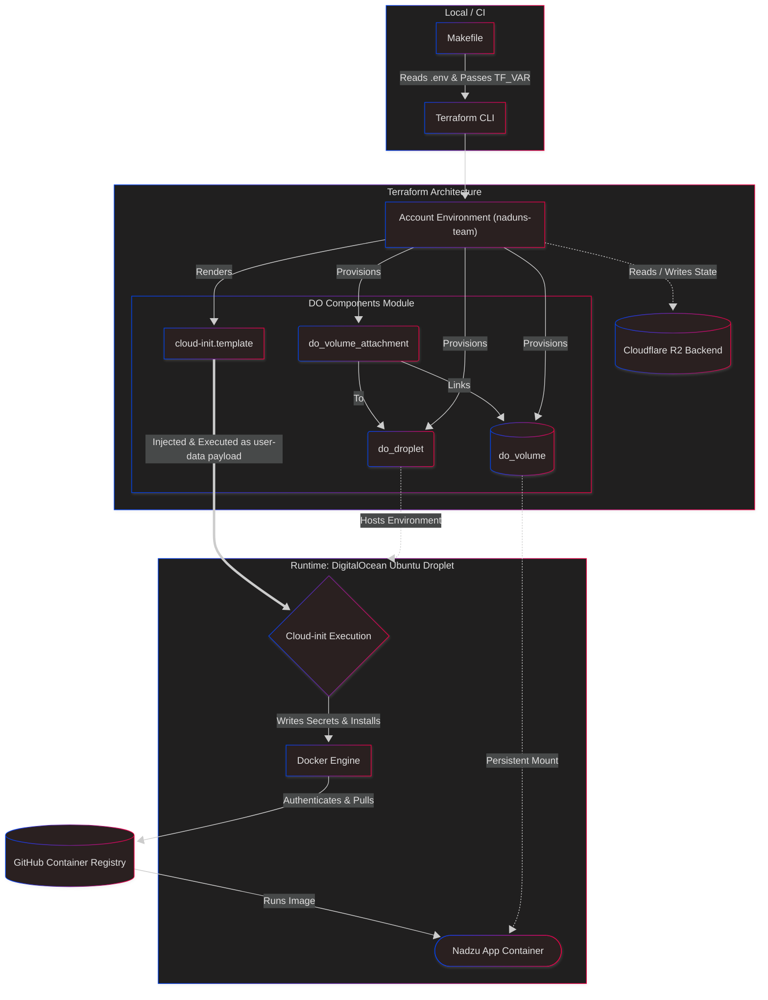

GitHub README files don't support Mermaid diagram themes directly, so this diagram is rendered in a separate file and linked here. The code for the diagram is as follows:

```mermaid
---
config:
  theme: neo-dark
  look: neo
  layout: dagre
---
flowchart TB
 subgraph Local_CI["Local / CI"]
        TF["Terraform CLI"]
        Make["Makefile"]
  end
 subgraph DO_Components_Module["DO Components Module"]
        Droplet("do_droplet")
        Volume[("do_volume")]
        VolAttach("do_volume_attachment")
        CloudInit["cloud-init.template"]
  end
 subgraph Terraform_Architecture["Terraform Architecture"]
        RootEnv["Account Environment (naduns-team)"]
        R2Backend[("Cloudflare R2 Backend")]
        DO_Components_Module
  end
 subgraph Provisioned_System["Runtime: DigitalOcean Ubuntu Droplet"]
        Boot{"Cloud-init Execution"}
        Docker["Docker Engine"]
        Container(["Nadzu App Container"])
  end
    Make -- "Reads .env & Passes TF_VAR" --> TF
    TF --> RootEnv
    RootEnv -. Reads / Writes State .-> R2Backend
    VolAttach -- Links --> Volume
    VolAttach -- To --> Droplet
    RootEnv -- Provisions --> Droplet & Volume & VolAttach
    RootEnv -- Renders --> CloudInit
    CloudInit == "Injected & Executed as user-data payload" ===> Boot
    Droplet -. Hosts Environment .-> Provisioned_System
    Boot -- Writes Secrets & Installs --> Docker
    Docker -- Authenticates & Pulls --> GHCR[("GitHub Container Registry")]
    GHCR -- Runs Image --> Container
    Volume -. Persistent Mount .-> Container

```